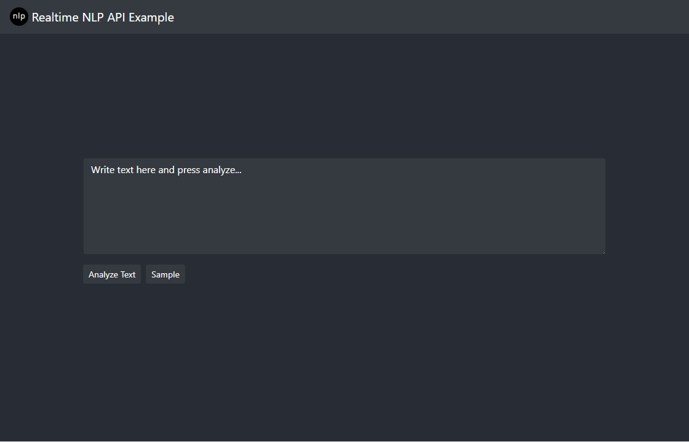

## Table of contents

<!-- toc -->
- [Prerequisites](#prerequisites)
- [Running the example app](#running-the-example-app)
  * [Manual setup](#manual-setup)  
<!-- tocstop -->  
  
## Prerequisites

- [git](https://git-scm.com/book/en/v2/Getting-Started-Installing-Git)
- [yarn](https://yarnpkg.com/en/docs/install) or [npm](https://www.npmjs.com/get-npm)

## Running the example app

This example is a simple nlp app. With little effort, you can customize the app appearance and data sources.  
_Currently the first analyze takes longer as the proxy is connecting to the backend._

### Manual setup

1. Install [Yarn](https://yarnpkg.com/lang/en/docs/install), as it is required build the components locally.

2. Clone the repository

   ```
   git clone https://github.com/matias-kovero/nlp-example.git
   ```

3. Navigate into the project and install component dependencies

   ```
   cd nlp-example && yarn
   ```

4. Create an environment file

   Copy the `.env` file in your root to `.env.local` file also to your root, and populate the following values:

   ```
   REACT_APP_COLLECTION_ID=REPLACE_ME  
   REACT_APP_NAME=REPLACE_ME   
   ```

   1. `REACT_APP_COLLECTION_ID` this will be used in your request to forward them to the right collection.
   2. `REACT_APP_NAME` just to personalize the app. This will appear on the navbar and the page title.  

5. Personalize the app
   - Replace the default image in `/src/logo.png` (`.png` and `.svg` are valid)
   - Update image path to match your image name in `/src/App.js`
      ```js
      import logo from './logo.png'; // ./imgname.imgtype
      ```
   - Update colors in `/src/App.js`
      ```js
      const colors = {
        background: '#282c34',
        textColor: '#ffffff',
        navbarColor: '#343a40',
        navbarDark: true,
        formColors: '#343a40'
      };
      ```
5. Build the React app:

   ```
   yarn run build
   ```

6. Setup the proxy

   - Create a `.server-env` file to your project root with the following values:
     ```
     BASE_URL=REPLACE_ME
     TOKEN=REPLACE_ME
     ```
     where:
     - `BASE_URL` is the protocol + host + port of the location that CP4D UI is hosted (ex. `https://my-cluster-name.com:443`)
     - `TOKEN` is the Authorization token used to authorize api requests.

7. Start the example app:

   ```
   yarn run start
   ```

8. Go to [localhost:3000](localhost:3000) in your browser. If everything is working, you should see something like this:

   
